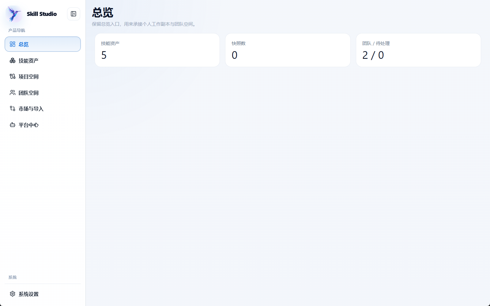
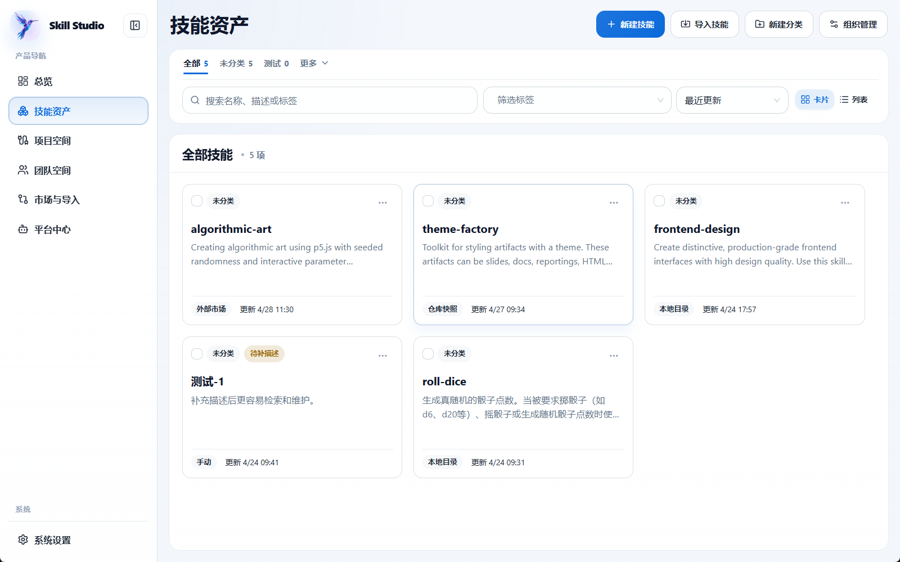
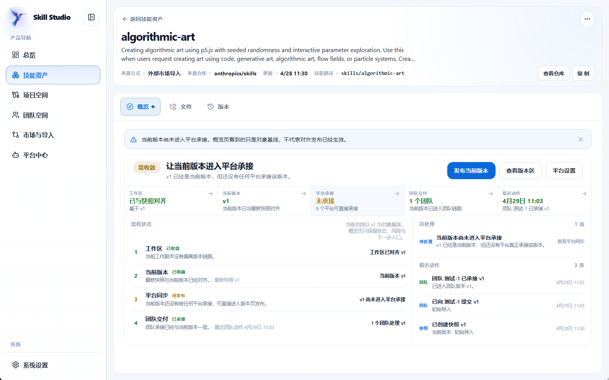
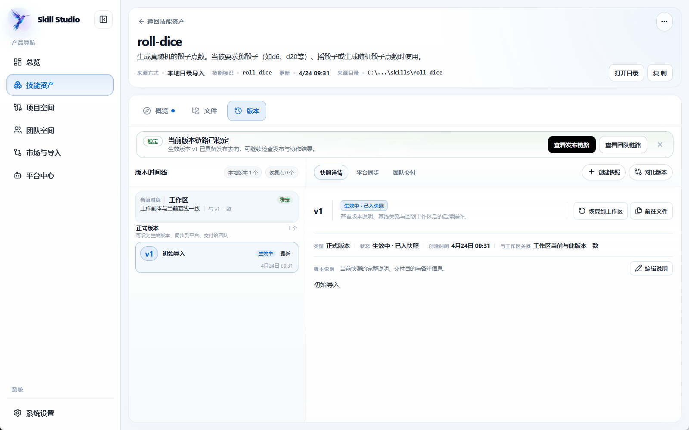
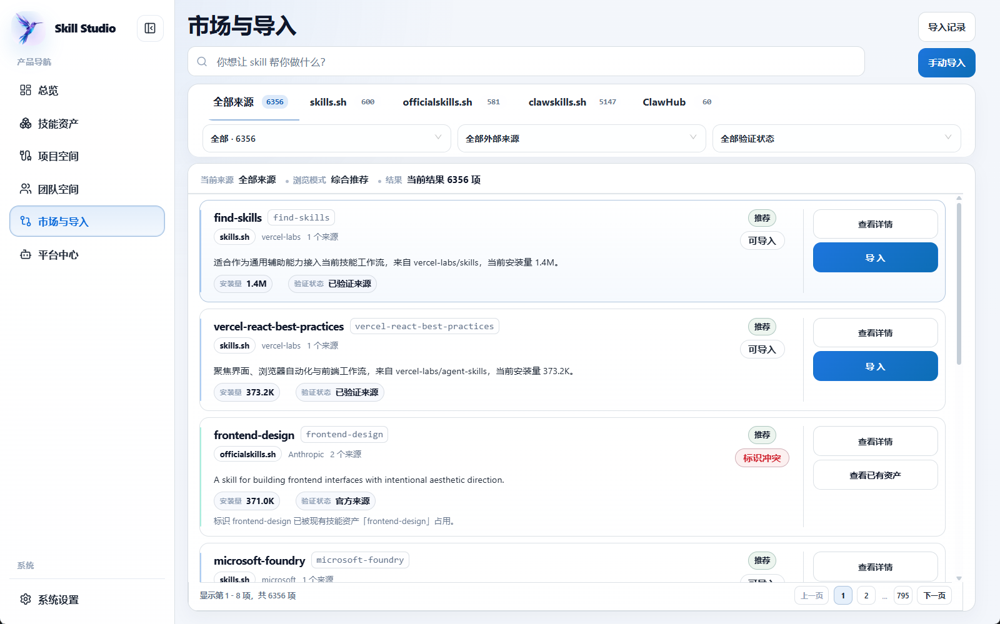
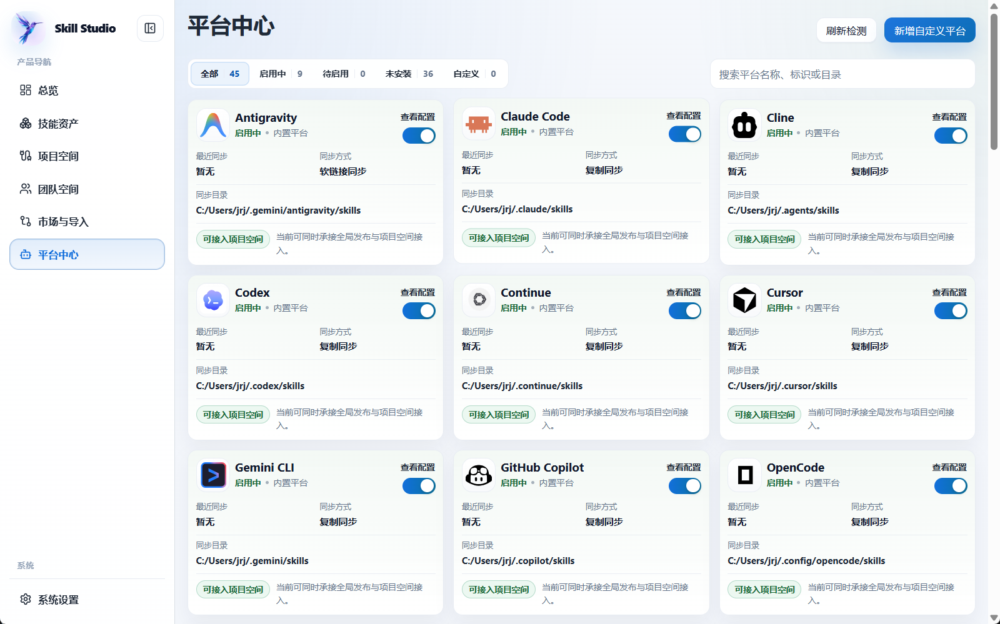
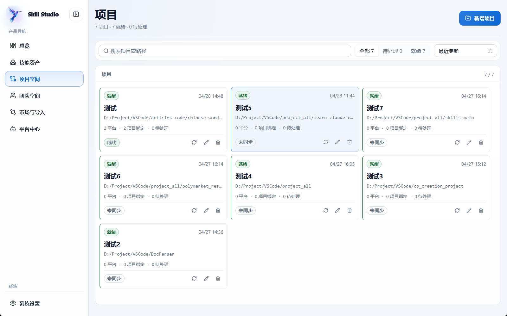
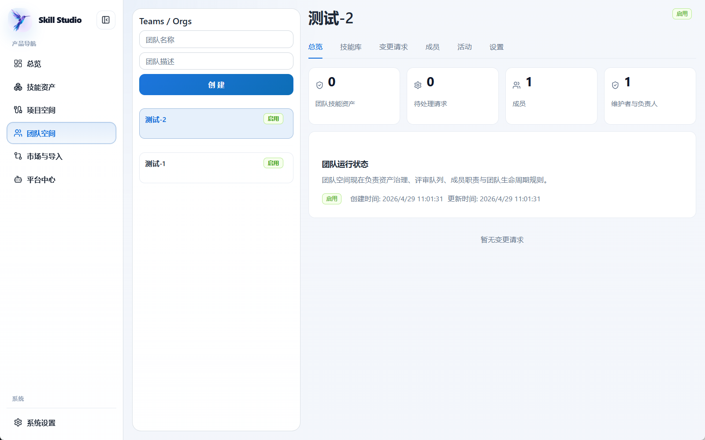

<p align="center">
  
</p>

<p align="center">

[](LICENSE)
[](https://github.com/liu673/skill-studio/releases)
[](https://github.com/liu673/skill-studio/releases)
[](https://v2.tauri.app)
[](https://react.dev)
[](https://www.rust-lang.org)
[](https://github.com/liu673/skill-studio/actions/workflows/ci.yml)
[](https://github.com/liu673/skill-studio/actions/workflows/release.yml)

</p>

---

# Skill Studio

Skill Studio is a local-first desktop application for managing AI Agent Skills: create, import, organize, version, compare, and sync Skill assets across platforms and teams.

It turns scattered Skill files into trackable, rollbackable, reusable, and deliverable assets. Supported platforms include Cursor, Claude Code, Codex, Windsurf, Roo Code, and 40+ others.

> **Status**: v0.1.0 is available as a cross-platform preview release. Windows, macOS, and Linux installers are available from [Releases](https://github.com/liu673/skill-studio/releases).

## Download

| Platform | Recommended download |
|----------|----------------------|
| Windows | Download the `.exe` or `.msi` from [Releases](https://github.com/liu673/skill-studio/releases) |
| macOS | Download the `.dmg` from [Releases](https://github.com/liu673/skill-studio/releases) |
| Linux | Download the `.AppImage`, `.deb`, or `.rpm` from [Releases](https://github.com/liu673/skill-studio/releases) |

Current installers are unsigned preview builds. Windows and macOS may show system security warnings; verify downloads with the SHA256 files attached to each release.

## Screenshots

<p align="center">
  
  <br><em>Dashboard</em>
</p>

<p align="center">
  
  <br><em>Skills Workspace</em>
</p>

<p align="center">
  
  <br><em>Skill Detail</em>
</p>

<p align="center">
  
  <br><em>Version Compare</em>
</p>

<p align="center">
  
  <br><em>Market</em>
</p>

<p align="center">
  
  <br><em>Platform Center</em>
</p>

<p align="center">
  
  <br><em>Project Workspace</em>
</p>

<p align="center">
  
  <br><em>Team Space</em>
</p>

---

## Contents

- [Features](#features)
- [Download](#download)
- [Screenshots](#screenshots)
- [Quick Start](#quick-start)
- [Core Concepts](#core-concepts)
- [Supported Platforms](#supported-platforms)
- [Architecture](#architecture)
- [Development](#development)
- [Build](#build)
- [Release Guide](docs/RELEASE.md)
- [Roadmap](ROADMAP.md)
- [Security](#security)
- [Contributing](#contributing)
- [License](#license)

---

## Features

| Module | Capabilities |
|--------|-------------|
| **Dashboard** | Overview of personal Skills, snapshots, team pending items, and asset health. |
| **Skills Workspace** | Create, import, search, categorize, tag, and batch-manage Skills. |
| **Skill Detail** | Browse file tree, read/edit files, open in external editor, open directory. |
| **Version Snapshots** | Create snapshots, view history, compare diffs, restore working copy, set active version. |
| **Market & Import** | Import from local directories, Git repositories, built-in templates, and external Skill markets. |
| **Platform Center** | Detect agent platform directories, configure sync targets and modes. |
| **Project Workspaces** | Bind Skills and platform directories to projects, generate and execute sync plans. |
| **Team Spaces** | Shared Skill library, submissions, diff review, merge, recommended versions, and pull. |
| **Settings** | Theme, language, pre-sync restore points, snapshot retention limits, and data directory. |

---

## Quick Start

### Install

Download a pre-built release for your platform from the
[Releases](https://github.com/liu673/skill-studio/releases) page.

> **Note**: Each release body lists the platform installers, checksum files, auto-update prerequisites, and preview-build limits. See [docs/release-notes.md](docs/release-notes.md) for the release note template used by the workflow.

> **Note**: Current pre-built artifacts are unsigned preview builds. Windows and
> macOS may show system security warnings. After users install a baseline build
> that includes the updater, future versions can be updated from inside the app.
> Verify downloaded files with the SHA256 checksum files attached to each release.

### Build from Source

```bash
# Prerequisites: Node.js 18+, Rust 1.75+, Git, Tauri system dependencies
git clone https://github.com/liu673/skill-studio.git
cd skill-studio
npm install
npm run tauri dev
```

### Run Checks

```bash
npm run check   # full validation suite
npm test        # frontend tests only
```

---

## Core Concepts

| Concept | Description |
|---------|-------------|
| **Skill** | An agent-usable capability package, typically containing a `skill.md` and supporting files. |
| **Working Copy** | The Skill directory currently being edited. May not yet be committed as a stable version. |
| **Snapshot** | A point-in-time, complete copy of a Skill directory with a sequential number, summary, and revision hash. |
| **Active Version** | The snapshot designated as the current stable, releasable, or sync-ready version. |
| **Source Record** | Provenance metadata for a Skill: manual creation, local import, Git import, market import, or platform scan. |
| **Platform Connection** | Configuration for an agent platform's Skill directory (e.g., Cursor, Claude Code, Codex). |
| **Project Workspace** | A project-scoped scope that binds Skills and platform directories for coordinated sync. |
| **Team Version** | A stable Skill version in the team library, available for review, recommendation, and pull. |

---

## Supported Platforms

Skill Studio ships with recognition rules for 45+ agent platforms and supports
custom platform definitions. Built-in platforms include:

```
Cursor · Claude Code · Codex · OpenCode · Antigravity · Amp · Kilo Code ·
Roo Code · Goose · Gemini CLI · GitHub Copilot · OpenClaw · Droid ·
Windsurf · TRAE IDE · Cline · Deep Agents · Firebender · Kimi Code CLI ·
Replit · Warp · Augment · IBM Bob · CodeBuddy · Command Code · Continue ·
Cortex Code · Crush · iFlow CLI · Junie · Kiro CLI · Kode · MCPJam ·
Mistral Vibe · Mux · Neovate · Pochi · Qoder · Qwen Code · TRAE CN ·
Zencoder · AdaL · Hermes Agent
```

Platform sync currently uses directory copy by default. Symbolic link mode
is available for platforms that support it.

---

## Architecture

For technical details on the frontend module layout, Rust backend layers,
data storage, and key design decisions, see [docs/ARCHITECTURE.md](docs/ARCHITECTURE.md).

```
┌──────────────────────────────────────────┐
│          Desktop Shell (Tauri 2)         │
│  ┌────────────────┐   ┌───────────────┐  │
│  │ React Frontend │   │ Rust Backend  │  │
│  │   TypeScript   │◄──┼──────────────►│  │
│  │  Tauri IPC     │   │  SQLite / FS  │  │
│  └────────────────┘   └───────────────┘  │
└──────────────────────────────────────────┘
```

---

## Development

### Environment Requirements

- Node.js 18 or later
- Rust 1.75 or later
- Git
- Platform build tools (see [Tauri prerequisites](https://v2.tauri.app/start/prerequisites/))

macOS and Windows: follow the official Tauri 2 guide.
Ubuntu/Debian:

```bash
curl --proto '=https' --tlsv1.2 -sSf https://sh.rustup.rs | sh -s -- -y
source "$HOME/.cargo/env"
sudo apt update
sudo apt install -y \
  pkg-config libwebkit2gtk-4.1-dev libxdo-dev libssl-dev \
  libayatana-appindicator3-dev librsvg2-dev fonts-noto-cjk
```

### Install and Run

```bash
npm install
npm run tauri dev        # full desktop app
npm run dev              # frontend only (no desktop features)
```

### Validation Commands

```bash
npm run typecheck        # TypeScript compilation
npm test                 # frontend tests (Vitest)
npm run build            # frontend production build
npm run rust:fmt         # Rust formatting check
npm run rust:check        # Rust compilation check
npm run rust:test         # Rust tests
npm run check            # all of the above
```

---

## Build

```bash
npm run tauri build
```

The current `bundle.targets` is set to `all`, which builds for the host
platform. For cross-platform releases, run the command on each target OS.

| Platform | Artifact |
|----------|----------|
| Windows | `.msi`, `.exe` installer |
| macOS | `.dmg` (unsigned preview builds may trigger Gatekeeper warnings) |
| Linux | `.AppImage`, `.deb`, `.rpm` |

> **Installer note**: All release artifacts should be accompanied by SHA256
> checksum files. The release body also explains the platform installers,
> update metadata, and signature files; see [docs/release-notes.md](docs/release-notes.md).
> See `scripts/generate_checksums.sh` and `scripts/generate_checksums.ps1`.

### Preview Release Limits

- Windows installers are not code-signed yet and may show unknown publisher or SmartScreen warnings.
- macOS installers are not signed or notarized yet and may require manual approval on first launch.
- Users must manually install a baseline build that includes the updater before automatic updates can work.
- Release artifacts should include SHA256 checksum files so users can verify download integrity.

### Auto-Update Release Requirements

- `src-tauri/tauri.conf.json` is configured to use GitHub Releases as the update endpoint.
- Release builds require the GitHub Secret `TAURI_SIGNING_PRIVATE_KEY`; if the key has a password, also add `TAURI_SIGNING_PRIVATE_KEY_PASSWORD`.
- Bump versions in `package.json`, `src-tauri/Cargo.toml`, and `src-tauri/tauri.conf.json` before publishing.
- Versions that do not include the updater cannot update automatically; users must install one updater-enabled baseline build manually.

See [docs/RELEASE.md](docs/RELEASE.md) for the full release process.

---

## Security

- **Local-only by default**: all data stays in `~/.skill-studio/`
- **Network access is scoped**: only market browsing and Git import make outbound requests
- **No auto-execution**: imported Skills are stored as files and never executed automatically
- **Sync is user-directed**: files are only written to directories explicitly configured by the user

See [SECURITY.md](SECURITY.md) for the full security policy, supported versions,
and vulnerability reporting process.

---

## Contributing

Contributions are welcome. Please read [CONTRIBUTING.md](CONTRIBUTING.md) before
submitting changes. Key points:

- Run `npm run check` before opening a pull request
- Follow [Conventional Commits](https://www.conventionalcommits.org/) for commit messages
- Include tests for new behavior
- Do not open public issues for security vulnerabilities; report them privately
  (see [SECURITY.md](SECURITY.md))

---

## License

Skill Studio is licensed under the **Apache License, Version 2.0**.
See [LICENSE](LICENSE) and [NOTICE](NOTICE) for details.

---

## Trademark

Skill Studio is a project name and trademark. Third-party platform names and
logos referenced in the application belong to their respective owners.
