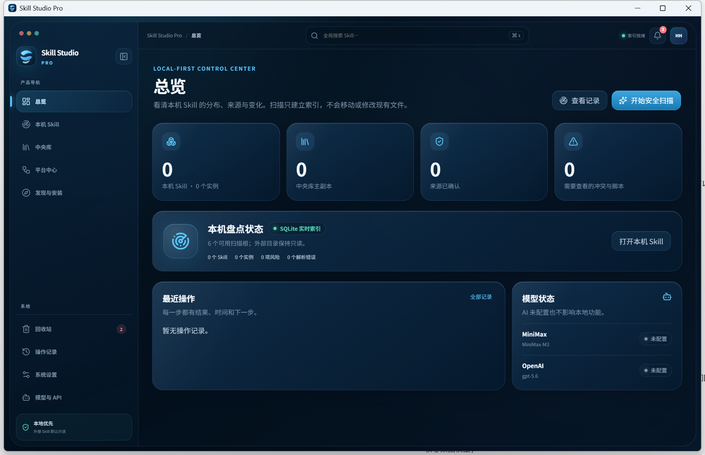

<p align="center">
  
</p>

# Skill Studio Pro

Skill Studio Pro is a local-first, open-source desktop application for discovering, understanding, and safely managing Skills across AI agents. It separates scanned external instances from a central source of truth and adds provenance evidence, snapshots, safe editing, multi-agent publishing, drift handling, trash, and optional AI summaries.

[中文 README](README.md)



The screenshot is from the isolated Windows release/NSIS UAT at 1280×800 logical pixels and 150% DPI. It contains no user Skills, real credentials, or personal paths.

## Public Beta capabilities

- Read-only discovery for Codex, Claude Code, Cursor, Windsurf, Gemini CLI, and custom roots.
- Raw `SKILL.md`, file trees, risks, duplicates, provenance evidence, and deterministic confidence scores.
- A unique central copy with snapshots and copy-based publishing to one or more agents.
- Safe editing for Markdown, YAML, JSON, TOML, and text, with recovery points and unsaved-change guards.
- Drift detection, explicit overwrite decisions, owned-target checks, trash, restore, and restricted permanent deletion.
- On-demand MiniMax/OpenAI-compatible enrichment with actual provider/model attribution and cache staleness.

See the [SPEC](docs/SPEC.md), [PRD](docs/PRD.md), [technical design](docs/TECHNICAL-DESIGN.md), and [test plan](docs/AUTOMATED-TESTING.md) for the complete contracts.

## Install

Download a platform artifact from the [v0.1.0-beta.1 prerelease](https://github.com/Hao2080/skill-studio-pro/releases/tag/v0.1.0-beta.1) and verify it with `SHA256SUMS.txt`.

| Platform | Artifact | Beta boundary |
|---|---|---|
| Windows x64 | NSIS setup `.exe` | Not Authenticode-signed; Windows may show an unknown-publisher or SmartScreen warning |
| macOS | `.dmg` | Not Developer ID-signed or notarized; manual approval may be required |
| Linux x64 | `.deb`, `.AppImage` | Not distribution-signed; persistent credentials require an unlocked Secret Service |

Real Windows, macOS, and Linux GitHub-hosted runners build the installers, install or mount them, launch the desktop executable, verify isolated bootstrap, and exercise each native Secret Store with a disposable test entry. Automatic updates remain disabled.

## Build from source

Install Node.js 22, stable Rust, Git, and the target platform's [Tauri 2 prerequisites](https://v2.tauri.app/start/prerequisites/).

```bash
git clone https://github.com/Hao2080/skill-studio-pro.git
cd skill-studio-pro
npm ci
npm run check
npm run supply-chain:check
npm run tauri -- build --ci
```

## Local data, API configuration, and privacy

The default workspace is `~/.skill-studio-pro/`, separate from upstream `~/.skill-studio/`. It stores the SQLite index, central Skills, snapshots, trash, staging journals, logs, and AI cache. Persistent API keys are stored only in Windows Credential Manager, macOS Keychain, or Linux Secret Service; the application never silently falls back to plaintext.

Configure provider URL, model ID, responsibility, timeout, and credentials under “Models & API.” AI is optional and on-demand. CI uses loopback mock providers and never calls paid endpoints. Core inventory, editing, publishing, and recovery remain available offline.

Imported Skills are untrusted input and are never executed during scan, preview, import, or summarization. High-risk writes use plans, hashes, owned-target checks, allowed-root validation, staging, atomic replacement, and recovery paths.

## Supply chain and upstream

Releases include reproducible CycloneDX 1.6 SBOMs for npm and Rust, a machine-readable license inventory, SHA-256 manifests, smoke results, and the [third-party dependency/asset report](docs/THIRD-PARTY-NOTICES.md). CI rejects stale SBOMs, unknown licenses, disallowed copyleft, secrets, user data, and broken repository metadata.

Skill Studio Pro is Apache-2.0 software derived from [liu673/skill-studio](https://github.com/liu673/skill-studio) at [`cd0bb0af53865d4a9643968080bfc5a8137b72d9`](https://github.com/liu673/skill-studio/commit/cd0bb0af53865d4a9643968080bfc5a8137b72d9). Upstream authorship, history, LICENSE, NOTICE, and required attribution are preserved. `upstream` remains the upstream remote; the Pro repository is the independent `origin`.

## Known limitations and troubleshooting

- The beta is unsigned, macOS is not notarized, and automatic updates are disabled.
- Symlink publishing depends on real OS capability and privilege; copy is the default and safe fallback selected by the user.
- Linux cannot persist credentials without an available, unlocked Secret Service.
- Real provider compatibility depends on the user's endpoint, model, account, and quota and is not implied by the release.
- For a blank window or startup error, verify Tauri/WebView prerequisites and launch from a terminal to retain logs.
- For security reports use GitHub Private Vulnerability Reporting as described in [SECURITY.md](SECURITY.md).

See [CHANGELOG.md](CHANGELOG.md), [release notes](docs/release-notes.md), [CONTRIBUTING.md](CONTRIBUTING.md), and [CODE_OF_CONDUCT.md](CODE_OF_CONDUCT.md).
