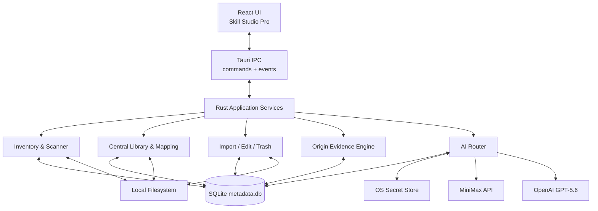

# Skill Studio Pro 详细技术方案

文档状态：Draft 0.2（V1 产品闭环修订）
日期：2026-07-16
依赖文档：[SPEC.md](./SPEC.md)、[PRD.md](./PRD.md)  
上游审计基线：`liu673/skill-studio@cd0bb0af53865d4a9643968080bfc5a8137b72d9`

## 1. 设计目标

本方案在不推翻上游架构的前提下，把 Skill Studio 扩展为 Skill Studio Pro。核心技术目标是：

1. 保留 Tauri 2 + React 18 + TypeScript + Rust + SQLite 技术栈。
2. 复用上游工作区、Skill CRUD、快照、来源、导入、平台、发布和差异组件。
3. 新增全机盘点索引、证据化来源推断、中央库映射、回收站、模型路由和安全凭据。
4. 所有破坏性文件操作具备边界检查、操作计划、原子写入和恢复路径。
5. 后端业务逻辑可脱离 Tauri 窗口运行测试，外部模型可完全 Mock。

## 2. 上游审计结论

### 2.1 已确认架构

上游当前使用：

- React 18、TypeScript、Vite、React Router、Ant Design、Lucide
- Tauri 2 桌面壳
- Rust 后端和 Tauri IPC
- `rusqlite` bundled SQLite
- 本地工作区 `~/.skill-studio/`
- 完整目录快照和文本 diff
- 本地目录、Git 仓库和多个市场来源导入
- 40+ Agent 平台目录定义
- 复制与符号链接能力描述
- 平台发布目标、同步日志和项目级映射
- Apache-2.0 LICENSE 与 NOTICE

### 2.2 可直接复用

| 上游模块 | 复用方式 |
|---|---|
| `src/app/AppShell.tsx`、导航和 Provider | 保留壳结构，调整信息架构和品牌 |
| `features/skills` | 复用列表、详情、文件树和编辑相关组件 |
| `features/snapshots` | 复用快照、历史、恢复和 diff |
| `features/market` | 复用 Git/市场导入流程，增加 ZIP 和安装预览 |
| `features/platforms` | 复用平台中心和 40+ 平台定义 |
| `features/projects` | 第一代作为可选高级功能，避免进入主流程 |
| `features/settings` | 扩展扫描、模型、隐私、凭据和回收站设置 |
| `src-tauri/src/store/import.rs` | 复用暂存和导入日志，增加事务计划 |
| `src-tauri/src/store/platform.rs` | 复用平台检测和发布，重构为 Adapter 注册表 |
| `src-tauri/src/snapshot` | 复用完整目录快照和恢复点 |
| `src-tauri/src/db` | 采用增量迁移扩展现有 SQLite |
| `shared/components/diff` | 直接复用文本和分栏差异视图 |

### 2.3 局部修改

- `skills` 从“仅中央资产”扩展为与“外部实例”分离的数据模型。
- `skill_sources` 增加确认状态、可信度、证据和用户覆盖。
- 平台发布加入漂移检测、目标哈希、原子替换和逐目标事务状态。
- `skill_delete` 改为回收站流程；永久删除成为独立受限命令。
- 设置存储拆分为普通配置与系统安全凭据引用。
- 导航隐藏团队模块，增加本机 Skill、回收站、操作记录和模型状态。

### 2.4 必须新增

- 扫描根、扫描运行、外部 Skill 实例和文件索引
- 文件监听与增量扫描
- 来源证据和确定性可信度引擎
- 重复与漂移检测
- 回收站和恢复事务
- MiniMax/OpenAI Provider 与 AI 任务路由
- 操作系统凭据存储
- AI 产物、提示词版本和调用记录
- Pro 品牌与 Liquid Glass 风格 Token

### 2.5 第一代隐藏或停用

上游团队空间不删除代码，但从默认构建的主导航和用户流程中隐藏。团队相关数据库迁移保持兼容，避免破坏上游升级；不新增团队功能。

## 3. 总体架构



### 3.1 分层规则

1. React 组件不直接访问文件系统或数据库。
2. Tauri command 只负责参数校验、调用 service 和序列化错误。
3. Service 负责用例和事务编排。
4. Repository 负责 SQLite。
5. Adapter 负责 Agent、AI Provider、Secret Store 和文件系统差异。
6. 纯规则模块不得依赖 Tauri Runtime，以便单元测试。

## 4. 建议代码结构

```text
src/
  app/
  features/
    dashboard/
    inventory/          # 本机 Skill
    skills/             # 中央库和详情，复用上游
    snapshots/          # 复用上游
    market/             # 发现与安装
    platforms/          # 平台中心
    trash/              # 回收站
    activity/           # 操作记录
    ai-settings/        # 模型与 API
    settings/
  shared/
    tauri/
    components/
    model-attribution/
  styles/
    tokens.css
    pro-theme.css

src-tauri/src/
  commands/
    inventory.rs
    skills.rs
    platforms.rs
    imports.rs
    trash.rs
    ai.rs
    credentials.rs
    operations.rs
  services/
    inventory_service.rs
    library_service.rs
    mapping_service.rs
    lifecycle_service.rs
    trash_service.rs
    ai_service.rs
  inventory/
    scanner.rs
    parser.rs
    watcher.rs
    hashing.rs
    duplicates.rs
  origin/
    evidence.rs
    confidence.rs
    resolvers/
      path.rs
      git.rs
      plugin.rs
      install_log.rs
      content.rs
  platform/
    registry.rs
    adapter.rs
    definitions.rs
    publisher.rs
  ai/
    provider.rs
    router.rs
    minimax.rs
    openai.rs
    prompts.rs
    redaction.rs
  credentials/
    store.rs
  lifecycle/
    plan.rs
    file_transaction.rs
    import.rs
    edit.rs
    trash.rs
  db/
  store/
  workspace/
  snapshot/
```

保留上游路径时可逐步迁移，不要求一次性移动全部文件。新逻辑先放入独立模块，再让旧 command 调用新 service。

## 5. 本地数据目录

新安装默认使用：

```text
~/.skill-studio-pro/
  workspace.json
  metadata.db
  settings.json
  skills/                 # 中央 Skill 工作副本
  snapshots/
  trash/
    skills/
    manifests/
  imports/
  staging/
    scan/
    import/
    publish/
    restore/
  logs/
  cache/
    ai/
```

规则：

- 不自动复用或覆盖 `~/.skill-studio/`。
- 首次启动可提供“从 Skill Studio 导入”，执行前展示迁移计划。
- 数据目录可配置；变更目录必须执行完整性检查和可回滚迁移。
- API Key 不在该目录中，只保存 Secret Store 引用。

## 6. 数据模型

### 6.1 保留的上游核心表

- `skills`
- `skill_snapshots`
- `skill_sources`
- `skill_import_logs`
- `skill_tags`
- `skill_tag_relations`
- `skill_collections`
- `collection_items`
- `platform_connections`
- `sync_logs`
- `platform_release_targets`

第一代不删除项目和团队表，确保数据库迁移兼容。

### 6.2 `skills` 扩展

```sql
ALTER TABLE skills ADD COLUMN canonical_name TEXT;
ALTER TABLE skills ADD COLUMN active_content_hash TEXT;
ALTER TABLE skills ADD COLUMN lifecycle_state TEXT NOT NULL DEFAULT 'active';
ALTER TABLE skills ADD COLUMN trashed_at INTEGER;
```

`lifecycle_state` 取值：`active`、`trashed`、`restoring`、`deleting`。

### 6.3 扫描根 `scan_roots`

```sql
CREATE TABLE scan_roots (
  id                    TEXT PRIMARY KEY,
  root_type             TEXT NOT NULL,
  platform_name         TEXT,
  path                  TEXT NOT NULL,
  normalized_path       TEXT NOT NULL UNIQUE,
  enabled               INTEGER NOT NULL DEFAULT 1,
  recursive             INTEGER NOT NULL DEFAULT 1,
  watch_enabled         INTEGER NOT NULL DEFAULT 1,
  ignore_rules_json     TEXT,
  last_scan_at          INTEGER,
  created_at            INTEGER NOT NULL,
  updated_at            INTEGER NOT NULL
);
```

### 6.4 扫描运行 `scan_runs`

```sql
CREATE TABLE scan_runs (
  id                    TEXT PRIMARY KEY,
  mode                  TEXT NOT NULL,
  status                TEXT NOT NULL,
  roots_total           INTEGER NOT NULL DEFAULT 0,
  roots_completed       INTEGER NOT NULL DEFAULT 0,
  candidates_seen       INTEGER NOT NULL DEFAULT 0,
  instances_changed     INTEGER NOT NULL DEFAULT 0,
  error_count           INTEGER NOT NULL DEFAULT 0,
  started_at            INTEGER NOT NULL,
  completed_at          INTEGER,
  cancelled_at          INTEGER,
  error_summary         TEXT
);
```

### 6.5 外部实例 `skill_instances`

```sql
CREATE TABLE skill_instances (
  id                    TEXT PRIMARY KEY,
  central_skill_id      TEXT,
  scan_root_id          TEXT,
  platform_name         TEXT,
  scope_type            TEXT NOT NULL,
  absolute_path         TEXT NOT NULL,
  normalized_path       TEXT NOT NULL UNIQUE,
  folder_name           TEXT NOT NULL,
  parsed_name           TEXT,
  canonical_name        TEXT NOT NULL,
  description           TEXT,
  short_description     TEXT,
  content_hash          TEXT NOT NULL,
  skill_md_hash         TEXT NOT NULL,
  manifest_hash         TEXT,
  file_count            INTEGER NOT NULL DEFAULT 0,
  has_scripts           INTEGER NOT NULL DEFAULT 0,
  has_executables       INTEGER NOT NULL DEFAULT 0,
  parse_status          TEXT NOT NULL,
  parse_error           TEXT,
  first_seen_at         INTEGER NOT NULL,
  last_seen_at          INTEGER NOT NULL,
  last_modified_at      INTEGER,
  missing_at            INTEGER,
  FOREIGN KEY (central_skill_id) REFERENCES skills(id),
  FOREIGN KEY (scan_root_id) REFERENCES scan_roots(id)
);
```

实例以规范化绝对路径为自然唯一键。Windows 路径比较需按文件系统语义处理大小写；数据库仍保存用户可读原路径。

### 6.6 文件索引 `skill_instance_files`

只保存进行变更、风险和文件树展示所需的摘要，不把文件正文放入 SQLite。

```sql
CREATE TABLE skill_instance_files (
  instance_id           TEXT NOT NULL,
  relative_path         TEXT NOT NULL,
  file_type             TEXT NOT NULL,
  size_bytes            INTEGER NOT NULL,
  modified_at           INTEGER,
  content_hash          TEXT,
  risk_flags_json       TEXT,
  PRIMARY KEY (instance_id, relative_path)
);
```

### 6.7 来源证据 `source_evidence`

```sql
CREATE TABLE source_evidence (
  id                    TEXT PRIMARY KEY,
  instance_id           TEXT,
  skill_id              TEXT,
  evidence_type         TEXT NOT NULL,
  evidence_key          TEXT NOT NULL,
  evidence_value        TEXT,
  source_candidate      TEXT,
  weight                INTEGER NOT NULL,
  is_conflict           INTEGER NOT NULL DEFAULT 0,
  resolver_version      TEXT NOT NULL,
  observed_at           INTEGER NOT NULL
);
```

### 6.8 来源结论 `source_resolutions`

```sql
CREATE TABLE source_resolutions (
  id                    TEXT PRIMARY KEY,
  instance_id           TEXT NOT NULL UNIQUE,
  source_type           TEXT NOT NULL,
  source_label          TEXT NOT NULL,
  source_ref            TEXT,
  confidence            INTEGER NOT NULL,
  resolution_status     TEXT NOT NULL,
  rationale             TEXT NOT NULL,
  user_confirmed        INTEGER NOT NULL DEFAULT 0,
  evidence_hash         TEXT NOT NULL,
  resolved_at           INTEGER NOT NULL,
  updated_at            INTEGER NOT NULL
);
```

### 6.9 AI 配置与产物

普通配置中不保存密钥。

```sql
CREATE TABLE ai_provider_configs (
  provider_id           TEXT PRIMARY KEY,
  provider_type         TEXT NOT NULL,
  display_name          TEXT NOT NULL,
  base_url              TEXT,
  default_model         TEXT,
  secret_ref            TEXT,
  enabled               INTEGER NOT NULL DEFAULT 0,
  timeout_ms            INTEGER NOT NULL DEFAULT 60000,
  last_test_status      TEXT,
  last_test_at          INTEGER,
  updated_at            INTEGER NOT NULL
);

CREATE TABLE ai_task_routes (
  task_type             TEXT PRIMARY KEY,
  provider_id           TEXT NOT NULL,
  model_id              TEXT NOT NULL,
  prompt_version        TEXT NOT NULL,
  enabled               INTEGER NOT NULL DEFAULT 1
);

CREATE TABLE ai_artifacts (
  id                    TEXT PRIMARY KEY,
  skill_id              TEXT,
  instance_id           TEXT,
  task_type             TEXT NOT NULL,
  provider_id           TEXT NOT NULL,
  model_id              TEXT NOT NULL,
  model_display_name    TEXT,
  responsibility        TEXT NOT NULL,
  prompt_version        TEXT NOT NULL,
  input_hash            TEXT NOT NULL,
  content_json          TEXT NOT NULL,
  status                TEXT NOT NULL,
  stale_at              INTEGER,
  created_at            INTEGER NOT NULL
);

CREATE TABLE ai_call_logs (
  id                    TEXT PRIMARY KEY,
  artifact_id           TEXT,
  provider_id           TEXT NOT NULL,
  model_id              TEXT NOT NULL,
  task_type             TEXT NOT NULL,
  status                TEXT NOT NULL,
  latency_ms            INTEGER,
  input_tokens          INTEGER,
  output_tokens         INTEGER,
  error_code            TEXT,
  error_summary         TEXT,
  started_at            INTEGER NOT NULL,
  completed_at          INTEGER
);
```

### 6.10 映射状态扩展

`platform_release_targets` 增加：

- `sync_mode`
- `target_path`
- `published_content_hash`
- `observed_target_hash`
- `drift_status`
- `last_checked_at`

### 6.11 回收站 `trash_entries`

```sql
CREATE TABLE trash_entries (
  id                    TEXT PRIMARY KEY,
  entity_type           TEXT NOT NULL,
  entity_id             TEXT NOT NULL,
  display_name          TEXT NOT NULL,
  original_path         TEXT NOT NULL,
  trash_path            TEXT NOT NULL UNIQUE,
  manifest_path         TEXT NOT NULL,
  related_state_json    TEXT NOT NULL,
  content_hash          TEXT NOT NULL,
  status                TEXT NOT NULL,
  deleted_at            INTEGER NOT NULL,
  restored_at           INTEGER,
  permanently_deleted_at INTEGER
);
```

### 6.12 操作记录 `operation_logs`

```sql
CREATE TABLE operation_logs (
  id                    TEXT PRIMARY KEY,
  operation_type        TEXT NOT NULL,
  entity_type           TEXT NOT NULL,
  entity_id             TEXT,
  target_label          TEXT NOT NULL,
  plan_json             TEXT,
  before_hash           TEXT,
  after_hash            TEXT,
  snapshot_id           TEXT,
  status                TEXT NOT NULL,
  error_code            TEXT,
  error_summary         TEXT,
  created_at            INTEGER NOT NULL,
  completed_at          INTEGER
);
```

## 7. 扫描与索引设计

### 7.1 扫描流水线


### 7.2 根目录解析

根来源包括内置 Agent 定义、自定义平台、额外扫描根、插件缓存、项目目录和中央库。嵌套根去重时保留最具体的来源标签，但同一实际目录只遍历一次。

### 7.3 目录遍历

- 避免跟随会形成循环的符号链接。
- 对无权限目录形成警告，不终止其他根。
- 默认忽略 `.git/objects`、`node_modules`、`target` 和用户配置项。
- 发现 `SKILL.md` 后将所在目录视为 Skill 根；仍索引其子文件，但对子目录中的第二个 `SKILL.md` 按独立 Skill 处理。
- 每个根设置文件数、单文件大小和最大深度保护，超限时记录不完整状态。

### 7.4 解析

解析器输出统一 `ParsedSkillMetadata`：

```rust
struct ParsedSkillMetadata {
    name: Option<String>,
    description: Option<String>,
    short_description: Option<String>,
    metadata: serde_json::Value,
    headings: Vec<String>,
    encoding: String,
    warnings: Vec<ParseWarning>,
}
```

需兼容 UTF-8 BOM、CRLF 和缺失 Front Matter。解析失败仍创建实例，`parse_status=error`。

### 7.5 哈希

- `skill_md_hash`：原始 `SKILL.md` 字节 SHA-256。
- `content_hash`：按规范化相对路径排序，组合文件类型、大小和文件哈希计算的目录 Merkle 摘要。
- 忽略规则版本进入哈希上下文，防止规则改变后误判一致。
- 大文件可使用分块读取，不把完整内容载入内存。

### 7.6 增量策略

1. 先比较路径、mtime、大小与上次摘要。
2. 有变化时计算文件哈希。
3. Skill 目录哈希未变则不重新运行来源和 AI 派生任务。
4. 文件监听事件进入去抖队列，同一 Skill 在短窗口内合并。
5. 定期或手动全量扫描修复监听漏报。

监听实现建议使用 Rust `notify` 生态并封装为 `WatcherAdapter`。

## 8. 来源推断与可信度

### 8.1 Resolver 顺序

1. 应用安装记录
2. 用户确认记录
3. Git remote、commit 和子目录
4. 插件 manifest 与缓存路径
5. 官方系统目录特征
6. 已知 Agent 路径
7. 文件内来源 URL、作者和 metadata
8. 目录名等弱特征

### 8.2 初始权重

| 证据 | 建议权重 |
|---|---:|
| 用户明确确认且未与当前路径矛盾 | 100，直接确认 |
| 应用安装记录与内容/commit 匹配 | +50 |
| Git remote、commit、子目录精确匹配 | +35 |
| 插件 manifest 精确声明 | +35 |
| 官方系统路径和签名同时匹配 | +30 |
| 已知 Agent 根目录匹配 | +15 |
| 文件内 source/author URL 匹配 | +10 |
| 名称或目录弱匹配 | +5 |
| 每项强冲突 | -25 |

规则：

- 无证据为 0，状态 `unknown`。
- 自动推断最高 99；只有用户确认或应用自身可验证安装记录可达到 100。
- 85–99 为高可信度，60–84 为中，1–59 为低。
- 多个候选接近时选择 `unknown` 或显示冲突，不强行给唯一来源。
- 算法版本写入证据哈希，升级后允许批量重算。
- MiniMax 仅可生成内容内来源候选，候选必须作为低权重证据并由本地规则验证。

## 9. 中央库与映射

### 9.1 中央 Skill 身份

中央 Skill 使用 UUID 为主键，slug 仅用于目录和发布。目录建议：

```text
skills/<skill-id>/<slug>/
```

若为兼容上游继续使用 `skills/<slug>/`，数据库必须阻止 slug 修改导致身份丢失，并通过事务重命名。

### 9.2 纳管流程

1. 解析并锁定外部实例当前哈希。
2. 生成操作计划和冲突预览。
3. 复制到 staging。
4. 验证 staging 哈希。
5. 原子移动到中央库目标。
6. 在同一 SQLite 事务中创建 `skills`、来源、实例关联和操作日志。
7. 创建初始快照。
8. 失败时清理 staging，外部实例不变。

### 9.3 Platform Adapter

```rust
trait PlatformAdapter {
    fn id(&self) -> &'static str;
    fn detect(&self, ctx: &PlatformContext) -> DetectionResult;
    fn default_global_skills_dir(&self, home: &Path) -> Option<PathBuf>;
    fn validate_target(&self, target: &Path) -> Result<(), PlatformError>;
    fn supports_symlink(&self) -> bool;
    fn prepare_publish(&self, skill: &CentralSkill, target: &Path) -> PublishPlan;
}
```

首要 Adapter：Codex、Claude Code、Cursor、Windsurf、Gemini CLI。其余上游定义通过通用目录 Adapter 保持可用，逐步补齐专属契约测试。

### 9.4 发布事务

单目标流程：

1. 读取已发布哈希并扫描目标哈希。
2. 若目标漂移，停止并要求选择策略。
3. 将来源快照复制到 `staging/publish/<operation-id>`。
4. 校验内容和路径。
5. 若目标存在，将其原子移动到同卷备份目录。
6. 将 staging 原子移动到目标；跨卷时复制后校验再替换。
7. 更新 release target 和日志。
8. 失败则恢复备份。

多个 Agent 逐目标执行，每个目标独立提交；返回部分成功列表。

### 9.5 符号链接

- 默认复制。
- 创建前检测操作系统权限、目标平台能力和目标父目录。
- Windows 无权限创建链接时明确降级建议，不自动改成复制而不告知用户。
- 删除映射只删除应用确认拥有的链接或受管副本。

## 10. 安装与导入

### 10.1 统一安装流水线

所有来源统一为：`SourceAdapter -> staging -> discovery -> preview -> validate -> central import -> optional publish`。

### 10.2 Source Adapter

```rust
trait ImportSourceAdapter {
    fn prepare(&self, request: &ImportRequest, staging: &Path) -> Result<PreparedSource, ImportError>;
    fn provenance(&self) -> ProvenanceSeed;
}
```

实现：本地目录、Git、ZIP、上游市场。

### 10.3 Git

复用上游 Git 导入方式。调用 Git 时必须使用参数数组，不拼接 shell 字符串。默认浅克隆；指定 commit 时固定到该 commit，并保存 remote、ref、commit 和子目录。

### 10.4 ZIP

- 限制解压总大小、文件数和单文件大小。
- 拒绝绝对路径、`..` 路径穿越、设备文件和越界符号链接。
- 解压后重新扫描 Skill，不信任压缩包声明。

### 10.5 安装预览

后端返回只读 `InstallPlan`，包含候选 Skill、文件统计、风险标记、来源、冲突、中央目标和平台目标。执行请求必须携带 plan ID 和 plan hash，防止预览后源内容被替换。

## 11. 编辑、快照与差异

- 复用上游文件树、文件读取、写入和 diff。
- 编辑 command 只接受 `skill_id + relative_path`，后端解析中央根并检查 `canonicalize` 后仍在根内。
- 保存使用同目录临时文件、flush、可选 fsync、原子 rename。
- 首次脏写前创建系统恢复点；同一编辑会话只创建一次。
- 保存后更新中央哈希并将已发布映射标记为 `outdated`。
- 外部编辑器返回后由 watcher 触发变更检测。

## 12. 回收站

### 12.1 软删除

1. 生成受影响映射和文件计划。
2. 默认先从受管平台移除映射；失败时允许取消或保留失败状态，不静默继续。
3. 创建删除前快照和 trash manifest。
4. 将中央目录移动到 `trash/skills/<trash-id>`。
5. 更新 Skill 生命周期和 `trash_entries`。
6. 操作任一步失败时根据日志恢复。

### 12.2 Manifest

回收站 manifest 至少包含：Skill ID、名称、slug、原路径、删除时间、内容哈希、来源、映射、活动快照和操作 ID。

### 12.3 恢复

- 校验回收内容哈希。
- 校验原路径边界和冲突。
- 恢复中央目录和数据库状态。
- 默认不自动重新发布到 Agent；恢复完成后向用户展示“恢复原映射”的可选操作。

### 12.4 永久删除

只接受 `trash_entry_id + confirmation_token`，后端根据数据库解析目录，不接受任意路径。永久删除前再次验证目录位于应用回收站根内。

## 13. AI Provider 与任务路由

### 13.1 统一接口

```rust
#[async_trait]
trait AiProvider {
    fn id(&self) -> &'static str;
    async fn test_connection(&self, model: &str) -> Result<ModelInfo, AiError>;
    async fn generate(&self, request: AiRequest) -> Result<AiResponse, AiError>;
}
```

`AiRequest` 包含任务类型、结构化输入、模型、超时、提示词版本和可取消令牌；不包含持久化明文 API Key。

### 13.2 默认路由

| task_type | Provider | 默认模型 | 输出 |
|---|---|---|---|
| `extract_usage` | MiniMax | 用户配置，初始推荐当前可用 MiniMax 文本模型 | 结构化用法、依赖、输入输出 |
| `suggest_tags` | MiniMax | 同上 | 标签候选 |
| `extract_origin_candidate` | MiniMax | 同上 | 待本地验证的来源候选 |
| `final_summary` | OpenAI | `gpt-5.6` | 一句话简介和简短说明 |
| `explain_conflict` | OpenAI | `gpt-5.6` | 冲突的用户可读解释 |
| `refine_usage` | OpenAI | `gpt-5.6` | 最终使用建议 |

模型 ID 必须存储为配置，不在业务代码中散布常量。模型退役时通过设置迁移和状态提示处理。

### 13.3 调用链

`final_summary` 可以使用本地解析结果和 MiniMax 结构化产物作为输入。MiniMax 不可用时，GPT-5.6 可只基于本地解析结果工作；GPT-5.6 不可用时，界面展示 MiniMax 提取结果和本地描述，不虚构最终摘要。

### 13.4 结构化输出

所有任务要求 JSON Schema 输出并在本地验证。验证失败最多进行一次修复请求；仍失败则保存错误，不把自由文本写入结构化字段。

### 13.5 提示词版本

提示词保存在源码的版本化模板中，例如 `summary/v1`。AI 产物保存模板版本和输入哈希。模板变更只标记旧产物过期，不自动产生费用。

### 13.6 脱敏

调用前执行：

- 文件名与内容秘密模式检测
- 环境变量值移除
- PEM、Token、API Key、认证头和常见凭据格式替换
- 用户敏感排除规则

命中高风险秘密时默认阻止发送，并允许用户查看阻止原因，不提供一键绕过完整密钥发送。

## 14. 凭据存储

实现 `CredentialStore`：

```rust
trait CredentialStore {
    fn set(&self, service: &str, account: &str, secret: &str) -> Result<(), CredentialError>;
    fn get(&self, service: &str, account: &str) -> Result<Option<String>, CredentialError>;
    fn delete(&self, service: &str, account: &str) -> Result<(), CredentialError>;
}
```

建议采用维护活跃的 Rust keyring 方案并分别验证：Windows Credential Manager、macOS Keychain、Linux Secret Service。Linux 后端不可用时，应用显示“安全凭据存储不可用”，禁止保存 Key；可允许仅当前进程内临时使用。

## 15. Tauri IPC 设计

### 15.1 主要命令

```text
inventory_root_list
inventory_root_upsert
inventory_scan_start
inventory_scan_cancel
inventory_instance_list
inventory_instance_get
inventory_instance_register

origin_resolution_get
origin_resolution_confirm
origin_resolution_recalculate

library_skill_list
library_skill_get
library_skill_create_snapshot
library_skill_publish_plan
library_skill_publish_execute
library_skill_remove_mapping

import_plan_create
import_plan_execute

trash_plan_create
trash_move_execute
trash_list
trash_restore_plan
trash_restore_execute
trash_purge_execute

ai_provider_list
ai_provider_save
ai_provider_test
ai_task_route_list
ai_task_route_save
ai_artifact_generate
ai_artifact_list

operation_list
```

### 15.2 事件

```text
inventory://scan-progress
inventory://instances-changed
inventory://watcher-status
library://mapping-status
operation://updated
ai://task-progress
ai://provider-status
```

事件只传递 ID、状态和轻量摘要；大对象由前端按需查询，避免窗口长时间运行后内存膨胀。

### 15.3 错误结构

统一返回：

```ts
interface AppError {
  code: string;
  message: string;
  userAction?: string;
  retryable: boolean;
  operationId?: string;
  details?: Record<string, unknown>;
}
```

`details` 在跨 IPC 前必须脱敏。

## 16. 前端设计

### 16.1 状态

保留 React Context + feature-local state。服务端数据建议使用轻量查询层封装缓存和失效，不要求立即引入全局状态库。扫描进度和 AI 任务通过事件更新。

### 16.2 路由

```text
/
/inventory
/inventory/:instanceId
/library
/library/:skillId
/platforms
/discover
/trash
/activity
/settings/general
/settings/scanning
/settings/ai
/settings/privacy
/about
```

### 16.3 Pro 主题

在上游 `tokens.css` 上增加语义 Token：

- `--pro-bg-deep`
- `--pro-surface-glass`
- `--pro-surface-elevated`
- `--pro-border-soft`
- `--pro-highlight`
- `--pro-text-primary`
- `--pro-text-secondary`
- `--pro-success/warning/danger`
- `--pro-blur-strength`

视觉效果必须有降级：系统关闭透明度或 GPU 性能不足时，使用不透明深海蓝表面。所有玻璃面板先保证对比度，再增加透明与模糊。

### 16.4 模型归属组件

新增统一 `ModelAttribution` 组件，输入 Provider、模型 ID、职责、时间、状态和过期信息。所有 AI 结果必须使用该组件，防止各页面表达不一致。

## 17. 文件事务与并发

### 17.1 操作锁

- 扫描可并发读取多个根，但单一 Skill 写操作串行。
- 中央 Skill 编辑、发布、回收、恢复共享 `skill_id` 级互斥锁。
- 平台目标使用规范化路径级锁。
- AI 任务不持有文件写锁，只读取固定输入哈希对应的快照。

### 17.2 计划与执行

所有高风险操作分两阶段：

1. `create_plan` 返回 plan ID、源哈希、目标和影响范围。
2. `execute` 校验 plan 未过期后执行。

源哈希或目标状态变化时返回 `PLAN_STALE`，要求重新预览。

### 17.3 崩溃恢复

文件事务在 staging 中保存 journal：阶段、源、目标、备份和预期哈希。应用启动时扫描未完成 journal，自动执行安全回滚或提示用户恢复。

## 18. 安全设计

1. `canonicalize` 并验证所有写入、移动和递归删除边界。
2. 禁止通过相对路径、junction、符号链接跳出允许根。
3. ZIP 解压防 Zip Slip。
4. Git 参数不经 shell 拼接。
5. 外部 Skill 从不自动执行。
6. 网络 Provider 只接收最小必要内容。
7. API Key 仅在调用时从系统凭据服务读取，并尽快释放。
8. 日志和错误统一脱敏。
9. Tauri capability 只开放必要命令和目录。
10. 发布流程执行依赖与秘密扫描。

## 19. 性能设计

- 应用启动先加载 SQLite 现有索引，扫描后台执行。
- 目录遍历使用有界并发，避免机械硬盘和杀毒软件压力。
- SQLite 写入按根或批次事务提交，启用合适的 WAL 和 busy timeout。
- 列表分页或虚拟化，避免一次渲染上千项。
- 文件树按需加载；正文不进入列表查询。
- AI 调用按 Provider 设置有界并发和退避。

## 20. 数据迁移

1. 数据库使用单调递增 schema version。
2. 每次迁移在事务内执行，并在迁移前备份 `metadata.db`。
3. 上游 `skills` 记录视为中央 Skill；首次运行补充 hash 和 lifecycle 字段。
4. 现有 `skill_sources` 转换为证据与来源结论，但保留原数据。
5. 现有 `platform_release_targets` 补算目标 hash；无法读取时标记 `unknown`。
6. 不自动导入 `~/.skill-studio/`，由用户确认迁移计划。

## 21. 开源与上游维护

- 继续采用 Apache-2.0。
- 保留原 LICENSE、NOTICE、作者和仓库链接。
- 新建独立应用标识、Logo、更新密钥和 Release 地址。
- README 明确基于哪个上游 commit，以及主要修改。
- 尽量通过新增 feature/module 而非大范围重写保留上游合并能力。
- 定期创建上游同步分支，先运行迁移和全量测试再合并。

## 22. 实施顺序

### Wave 0：基线

- Fork/导入上游
- 改名、独立包标识和许可证归属
- 建立 CI 和迁移测试基线

### Wave 1：可并行

- UI Shell、Pro 主题和 Mock 页面
- 扫描、实例索引、来源证据
- AI Provider、凭据和路由

### Wave 2：依赖 Wave 1 接口

- 中央库纳管
- Platform Adapter 和映射漂移
- 安装计划和 ZIP 导入

### Wave 3：生命周期

- 编辑事务完善
- 回收站、恢复和崩溃恢复
- 操作记录

### Wave 4：集成发布

- 真正 UI 接口联调
- 跨平台自动化测试
- 性能、安全、许可证和安装包验证

### Wave 5：V1 产品闭环

- 中央 Skill 真实编辑工作区
- AI 简介/用法生成、取消与重新生成入口
- 平台中心和扫描根真实管理
- 三个流程的跨层组件与 IPC 契约测试

### Wave 6：Windows 真实验收

- 使用隔离 Home、配置、中央库和 Agent 目录启动 release 应用
- 完整执行扫描、纳管、编辑、AI、发布、漂移、回收和恢复
- 记录 900×600、1280×800、高 DPI、键盘和降低透明度结果
- 发现缺陷后返回 Wave 5 修复并重跑全部门槛

### Wave 7：开源与跨平台发布

- 建立独立公开 `origin` 和 `main`
- 运行 Windows、macOS、Linux 真实 CI 与安装/启动 smoke
- 生成 SBOM、第三方许可证、SECURITY、CONTRIBUTING 和构建文档
- 生成公开 Beta 产物、校验文件、变更说明和已知限制

### Wave 8：独立发布审计

- 从 SPEC/PRD 反向检查 P0 闭环
- 审查公开仓库、历史秘密、产物内容和上游归属
- 运行最终回归、性能基准与发布阻断检查
- 只有全部门槛通过后才创建发布结论

## 23. 技术验收要点

1. 首次扫描对外部目录零写入。
2. 同名不同内容实例不会被数据库唯一约束错误合并。
3. 中央库和外部实例具有独立身份与关联。
4. 发布前能发现目标漂移，失败能恢复目标。
5. 永久删除 command 不接受任意文件路径。
6. MiniMax 和 OpenAI 可分别关闭、配置、Mock 和测试连接。
7. AI 产物都带实际模型和职责信息。
8. API Key 不进入数据库、日志或普通配置。
9. 上游快照、diff、市场和平台基础能力继续通过原测试。
10. 五个首要 Agent 在 Windows、macOS、Linux 的目录契约通过验证。

## 24. Draft 0.2 产品闭环实现

### 24.1 实现基线

`d626224` 已具备编辑、AI、平台、扫描和发布所需的后端 service、IPC 与类型化前端 API。Draft 0.2 的原则是复用这些接口补齐用户流程，不重写数据库、Platform Adapter、AI Provider 或文件事务。

生产 Tauri 页面调用真实 IPC；浏览器 `?preview=pro` 继续使用类型化 Mock，但 Mock 只能用于预览和测试，不能作为完成证据。

### 24.2 编辑器集成

建议新增 `src/features/editor/`，或在现有 Skill 详情内建立隔离的 Editor Workspace。状态机至少包括：

```text
readonly -> loading -> clean -> dirty -> saving -> clean
                                  |        |-> save_error -> dirty
                                  |-> discard -> clean
```

实现约束：

1. 只有中央 Skill 可进入编辑模式；外部实例显示纳管入口。
2. 文件内容按 Skill ID 与相对路径读取，不向前端开放任意绝对路径写入。
3. 每个编辑会话生成稳定 `editSessionId`，保存调用现有 `lifecycle_text_file_save`。
4. 前端可以提供即时语法提示，但 Rust 保存校验是最终权威。
5. 路由切换、文件切换和窗口关闭统一经过 dirty guard。
6. 保存成功后刷新内容哈希、快照、diff、操作记录和 mapping outdated 数量。
7. 保存失败不得清空输入或假装内容已落盘。
8. 二进制文件只读；外部编辑器通过受控命令打开，并在返回后触发漂移/变更检查。

### 24.3 AI 生成编排

详情页通过现有 `aiApi.generateArtifact`、`cancelArtifact` 和 `listArtifacts` 编排任务。每次调用使用唯一 `cancellationId`，并以 task、输入哈希、Provider、模型和 prompt version 作为缓存身份。

推荐流程：

1. 本地确定性解析先生成可展示基础信息。
2. 用户点击“生成简介/用法”，或显式开启自动补充后，按已启用路由生成 `extract_usage`、`suggest_tags` 等 MiniMax 结构化产物。
3. `final_summary` 由 OpenAI 路由生成最终简介；输入仅包含本任务必要原文片段和已验证结构化候选。
4. 部分任务失败时保留成功产物并显示具体失败，不阻断编辑、发布或回收站。
5. 内容、模型、路由或 prompt version 变化时旧产物显示 stale，重新生成使用 `force=true`。
6. 自动补充队列默认关闭；启用后使用有界并发，可暂停，不在首次扫描中无条件上传全部 Skill。

前端不得把配置模型名当成实际返回模型，也不得在 API Key 输入保存后继续持有明文。

### 24.4 平台中心与扫描根

平台中心复用 `platformsApi` 的检测、保存、治理影响、路径测试、自定义平台与映射接口；扫描根复用 `inventoryApi.listRoots/upsertRoot/startScan`。

页面加载时并行读取平台、扫描根和必要汇总，单项失败显示局部错误。路径保存流程为：选择/输入目录 → `test_platform_path` → 展示规范化路径和能力 → `save_platform_connection` → 重新检测。对仍有受管映射的平台执行停用、改目录或删除自定义平台前，必须先读取治理影响并要求确认。

扫描根移除若后端暂时没有独立删除命令，第一版使用 `enabled=false` 表示停用；不得通过前端拼接文件删除。若新增删除配置 IPC，只能删除数据库配置和可重建索引，不能删除目标目录。

### 24.5 真实 Windows 验收环境

真实验收使用应用已支持的 Home/config/workspace 注入，创建一次性测试根和五个 Agent 目录。测试 Skill 全部为仓库夹具或临时复制，不使用真实用户目录。

验收允许用户明确提供测试用 MiniMax/OpenAI 凭据，但不得写入测试报告、日志、截图、数据库或 Git。真实模型测试只验证连接、一次最小生成和模型归属；持续回归仍使用 Mock Provider。

### 24.6 开源发布工程

1. 建立 Pro 自有公开仓库和 `origin`；上游只保留为 `upstream`。
2. 当前 `wave-0-baseline` 在完成发布审计后合并或改名为 `main`，不得丢失历史。
3. PR/主分支 CI 在三种真实 OS Runner 执行 `npm run check`、仓库卫生、秘密与许可证检查。
4. Release workflow 生成平台安装包、SHA-256、SBOM、第三方清单和产物内容审计结果。
5. 自动更新在 Pro 自有签名密钥与端点完成前保持关闭。
6. macOS 公证、Windows 签名或 Linux 包签名未完成时，Beta 文档必须明确；不得使用上游密钥。

### 24.7 窗口依赖与交接协议

后续任务按顺序执行，避免多个窗口同时修改主工作区：

1. 产品闭环窗口：编辑器、AI 生成、平台/扫描根。
2. Windows 真实验收窗口：只在产品闭环提交后启动；发现问题直接修复并回归。
3. 开源与跨平台窗口：只在 Windows 验收通过后发布仓库和运行三平台流水线。
4. 最终审计窗口：只在真实 CI/Release 结果可读后开始。

每个窗口必须提交代码、生成 `docs/handoffs/` 交接文件、列出命令与结果，并以 `HANDOFF_READY` 结束。总控任务只以仓库、提交、交接和测试事实判断完成，不依赖人工复制聊天内容。
